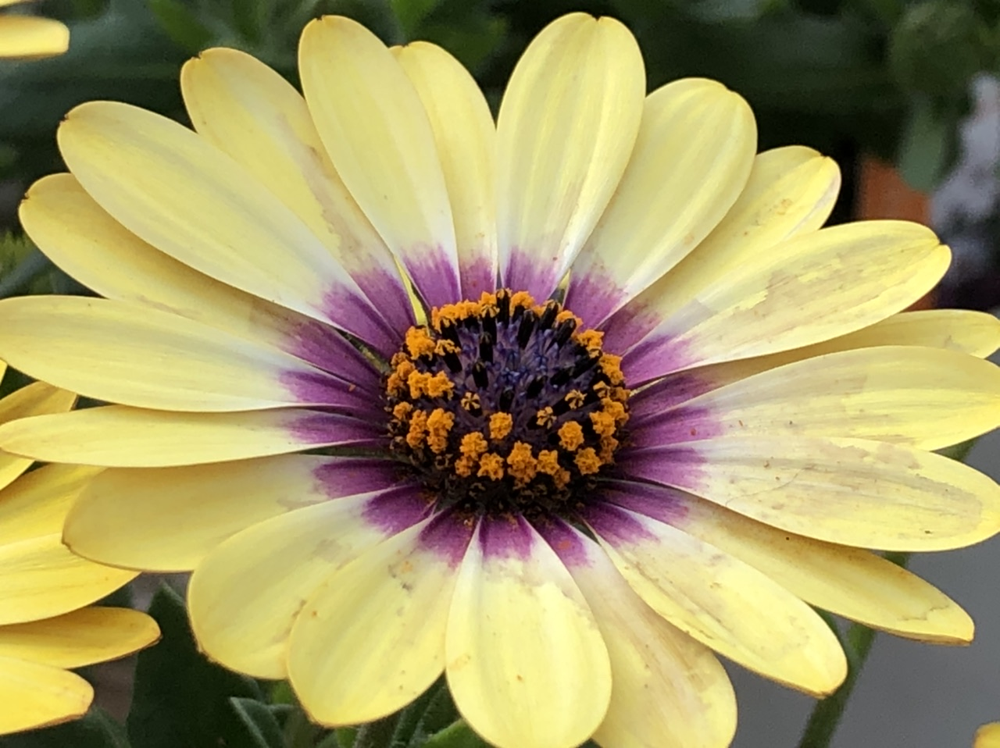
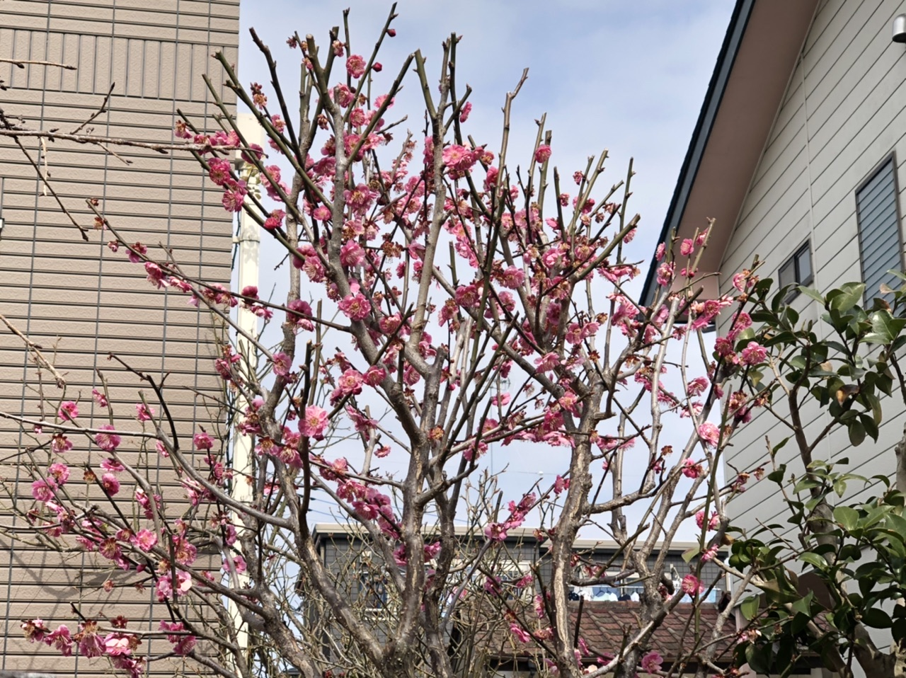
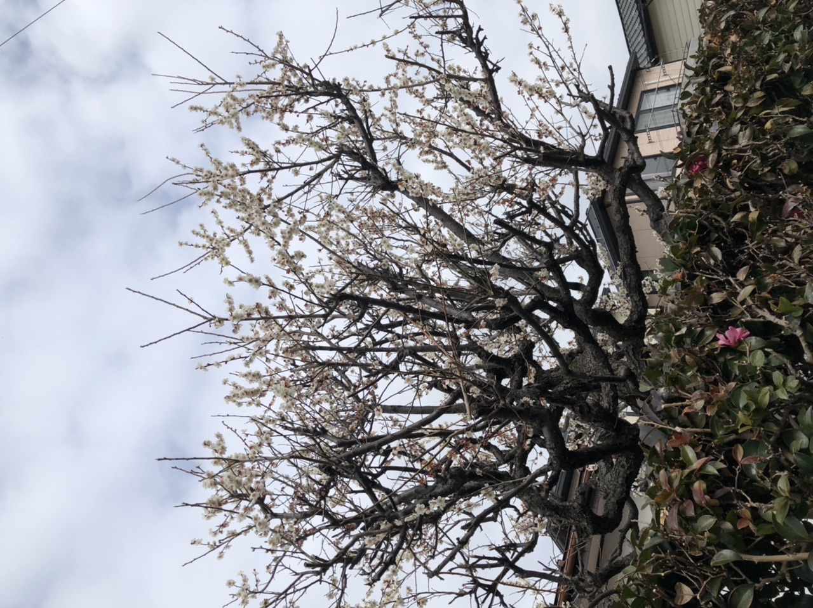
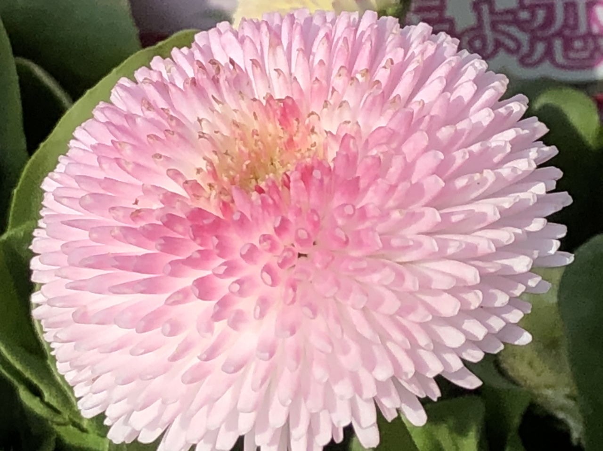
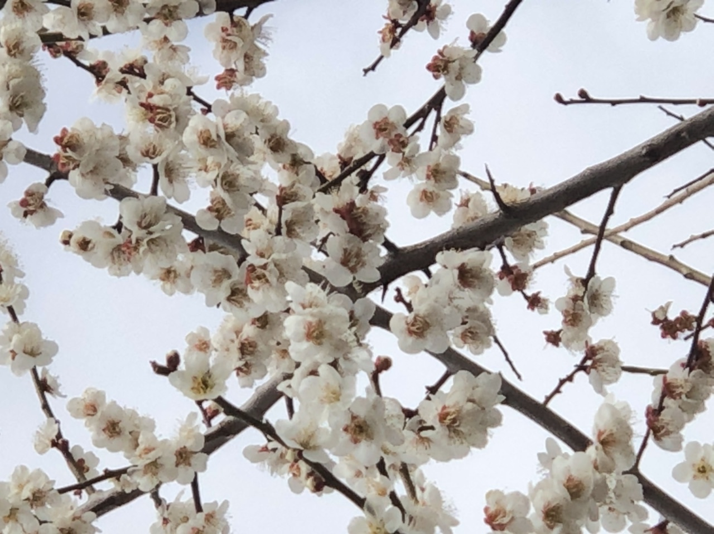
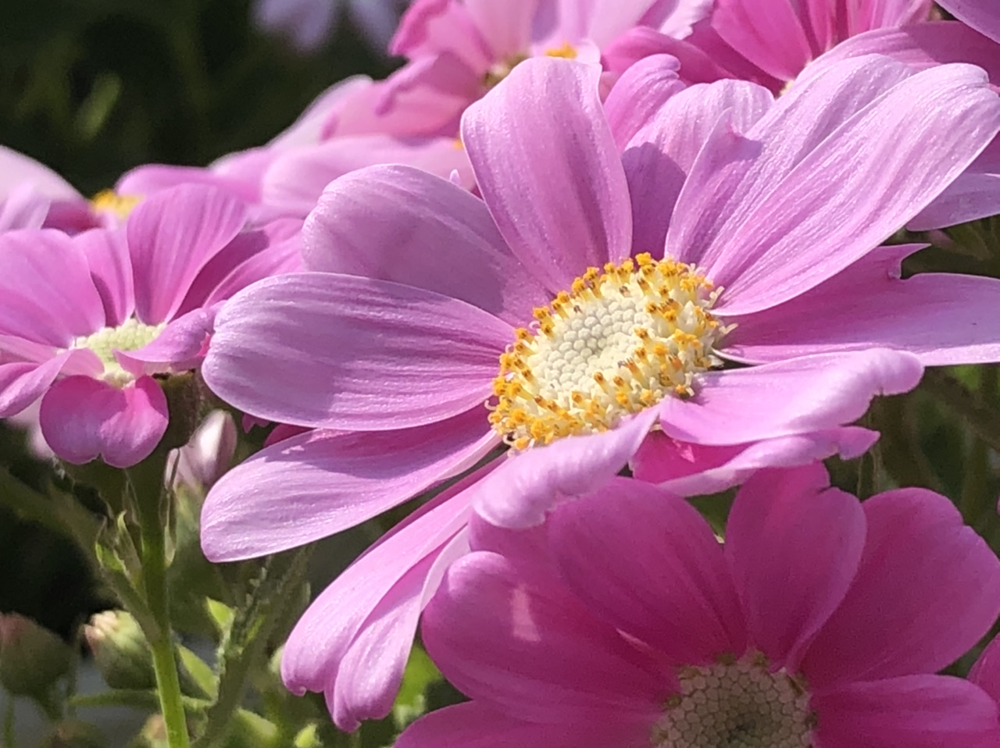
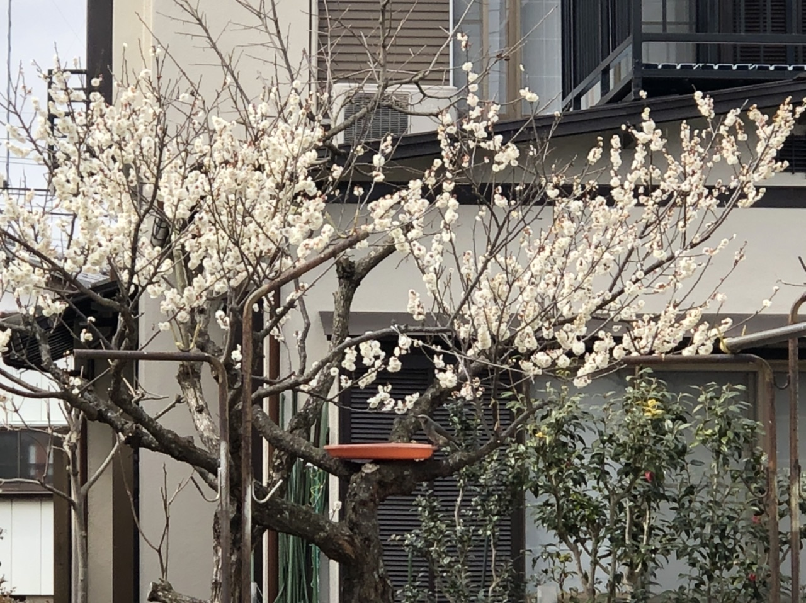

# ohana
<html lang="ja">
 <head>
  <meta charset="utf-8" />
	 

</head>
<body>

<a href="0FABF9AA-3E32-4BD2-9B93-69F62AEE46BC.jpeg" target="_blank" class="p"></a>
<a href="1B6A1608-7C70-4FEE-84FE-151E6833AECA.jpeg" target="_blank" class="p"></a>
<a href="29ECE2EC-FE45-42D1-9783-B6EDDFF21242.jpeg" target="_blank" class="p"></a>
<a href="52248E08-6F7C-46C8-8D81-A670B7204163.jpeg" target="_blank" class="p"></a>
<a href="74BDDFCF-BD9A-4626-A211-0CED842FFB0C.jpeg" target="_blank" class="p"></a>
<a href="7BD5D4F3-407C-4ABB-AC88-37447A69814C.jpeg" target="_blank" class="p"></a>
<a href="7FF04EF2-E6F8-44E4-ADC0-361AA7A3B5F1.jpeg" target="_blank" class="p"></a>
<a href="A53A0DEE-6DE2-443C-848A-4021D9133879.jpeg" class="p"></a>
<a href="C381FD03-2E36-407E-AFA6-FAD9176FAB0C.jpeg" target="_blank" class="p"></a>

<h2>
<a href="0FABF9AA-3E32-4BD2-9B93-69F62AEE46BC.jpeg" target="_blank" class="p">お花1</a>  
<a href="1B6A1608-7C70-4FEE-84FE-151E6833AECA.jpeg" target="_blank" class="p">お花2</a>  
<a href="29ECE2EC-FE45-42D1-9783-B6EDDFF21242.jpeg" target="_blank" class="p">お花3</a>  
<a href="52248E08-6F7C-46C8-8D81-A670B7204163.jpeg" target="_blank" class="p">お花4</a>  
<a href="74BDDFCF-BD9A-4626-A211-0CED842FFB0C.jpeg" target="_blank" class="p">お花5</a>  
<a href="7BD5D4F3-407C-4ABB-AC88-37447A69814C.jpeg" target="_blank" class="p">お花6</a>  
<a href="7FF04EF2-E6F8-44E4-ADC0-361AA7A3B5F1.jpeg" target="_blank" class="p">お花7</a>  
<a href="A53A0DEE-6DE2-443C-848A-4021D9133879.jpeg" class="p">お花8</a>  
<a href="C381FD03-2E36-407E-AFA6-FAD9176FAB0C.jpeg" target="_blank" class="p">お花9</a>  
</h2>

              

 

</body>

